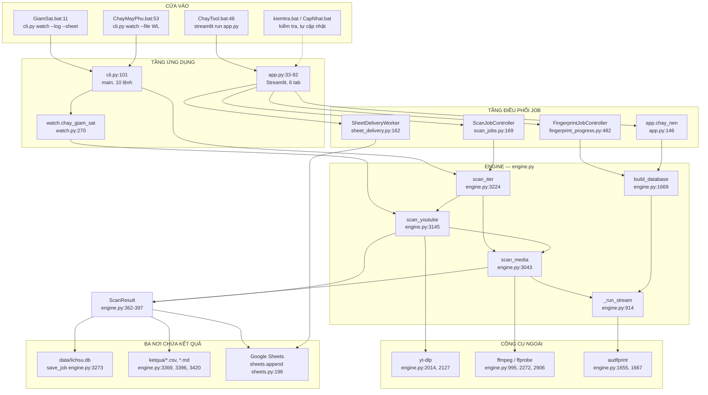
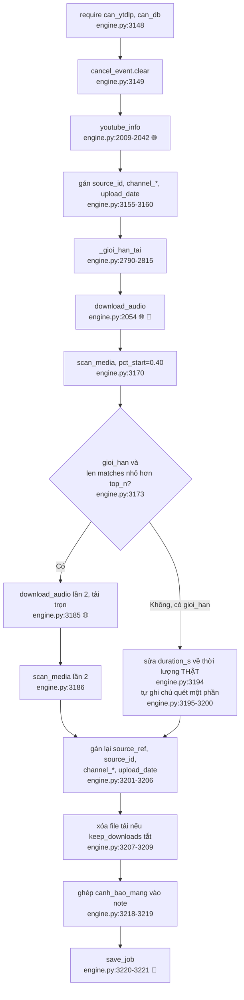
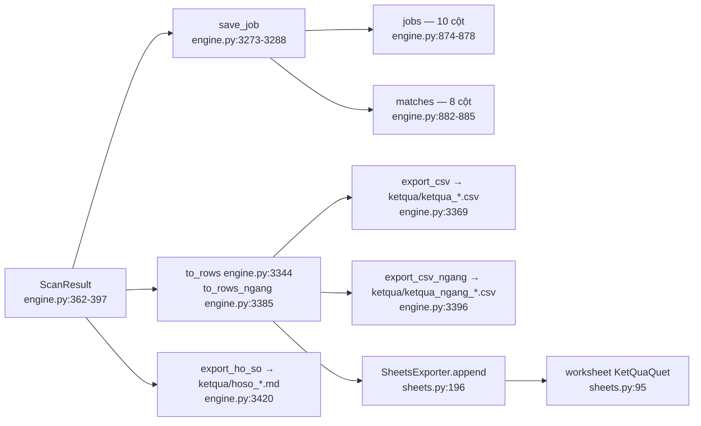
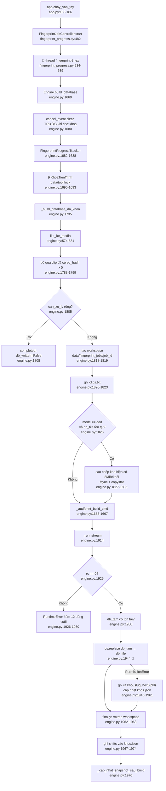
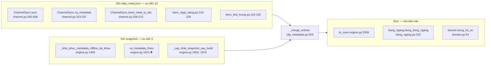
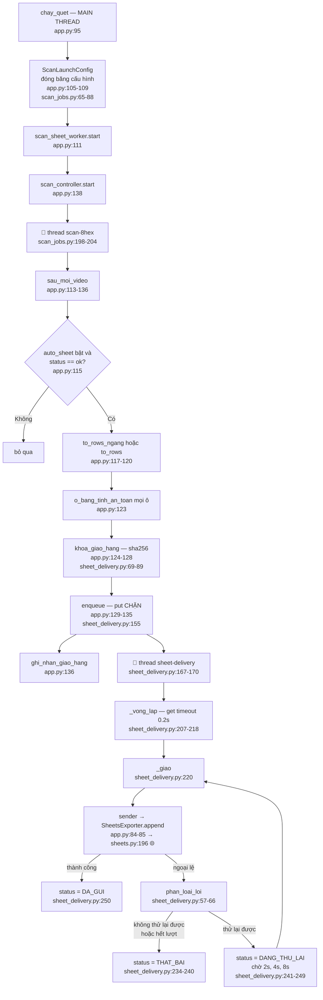

# SYSTEM MAP — Bản đồ cấu trúc TimClipPro

> **Tài liệu kiểm toán, không phải tài liệu thiết kế.** Nó mô tả hệ thống **đang là**,
> không phải hệ thống nên là. Không có thay đổi mã nguồn nào được thực hiện khi viết
> tài liệu này.

## 0. Cách đọc tài liệu này

**Mọi hộp trong mọi sơ đồ đều truy được về mã nguồn.** Nhãn hộp là tên symbol thật;
`file:line` đi kèm ngay dưới hộp hoặc trong bảng tra cứu bên cạnh sơ đồ. Nếu bạn không
tìm thấy `file:line` cho một hộp, đó là lỗi của tài liệu — hãy báo lại.

Quy ước ký hiệu dùng xuyên suốt:

| Ký hiệu | Nghĩa |
|---|---|
| `⬛` | Tiến trình HĐH riêng biệt |
| `🧵` | Thread nền trong tiến trình Python |
| `🔒` | Có giữ khóa liên tiến trình `data/tool.lock` |
| `🌐` | Có gọi mạng |
| `💾` | Có ghi xuống đĩa hoặc dịch vụ ngoài |
| `⚠` | Ghi chú cấu trúc: sơ đồ làm lộ ra một khiếm khuyết đã được xác nhận |

Các ô `⚠` chỉ trích dẫn phát hiện đã **CONFIRMED**. Chúng không phải suy đoán, và
chúng không đề xuất rằng đã có ai sửa. Mỗi ô nêu mã phát hiện để tra ngược.

Đường dẫn gốc của mọi trích dẫn: `C:/Users/Admin/OneDrive/Desktop/ToolQuet/Tool_Quet/TimClipPro/`

---

## 1. Sơ đồ tổng thể

Bốn cửa vào, một lõi `Engine`, ba công cụ ngoài, và ba nơi chứa kết quả cuối.



### 1.1 Bảng cửa vào

| Cửa vào | file:line | Dựng `Engine`? | Giữ `tool.lock`? |
|---|---|---|---|
| GUI Streamlit | `ChayTool.bat:46` → `app.py:41-45` | Có, **một Engine mỗi phiên trình duyệt** | Chỉ khi dựng kho vân tay |
| Giám sát máy chính | `GiamSat.bat:11` → `cli.py:88` | Có, `cli.py:182` | **Có** — `watch.py:287` |
| Giám sát máy phụ | `ChayMayPhu.bat:53` → `cli.py:88` | Có, `cli.py:182` | **Có** — `watch.py:287` |
| Lệnh thủ công | `cli.py:101-116`, 10 lệnh | Có, trừ `dung` và `vameta` | Tùy lệnh |

Mười lệnh CLI hợp lệ, đọc từ `cli.py:104-116`: `kenh`, `taodb`, `themclip`, `youtube`,
`file`, `watch`, `vameta`, `vametak`, `dondep`, `dung`.

Hai lệnh **cố ý không dựng Engine** và thoát trước dòng `eng = Engine()` ở `cli.py:182`:
`dung` (`cli.py:156-162`) và `vameta` (`cli.py:164-180`). Riêng `vameta` có ghi chú
trong mã giải thích lý do (`cli.py:167-168`).

### 1.2 Engine được dựng ở đâu

`Engine.__init__` (`engine.py:615-658`) là nơi mọi đường dẫn được chốt:

```
self.data_dir    = data_dir or <root>/data        engine.py:632
self.dl_dir      = <data_dir>/downloads           engine.py:636
self.out_dir     = out_dir or <root>/ketqua       engine.py:638
self.sqlite_file = <data_dir>/lichsu.db           engine.py:639
self.kho_file    = <data_dir>/khos.json           engine.py:648
```

Ba thư mục được tạo ngay (`engine.py:641-642`): `data_dir`, `dl_dir`, `out_dir`.
`bin/` được chèn vào `PATH` của **cả tiến trình** (`engine.py:645-646`) và không bao
giờ được khôi phục.

> ⚠ **Ghi chú cấu trúc (AUD-004 / AUD-185, CONFIRMED).** `Engine.__init__` ở
> `engine.py:632` **không** đọc biến môi trường `TIMCLIP_DATA_DIR`, trong khi hàm trợ
> giúp `thu_muc_data_mac_dinh` (`engine.py:608`) thì có. `app.py:43` truyền biến này
> vào một cách tường minh; `cli.py:182` thì không. Hệ quả: `cli.py vameta` đọc cấu hình
> mạng từ `$TIMCLIP_DATA_DIR/cau_hinh.json` (qua `cli.py:171`) còn mọi lệnh CLI khác đọc
> từ `<repo>/data/cau_hinh.json`.

---

## 2. Sơ đồ luồng QUÉT

Đây là luồng dài nhất trong hệ thống. Chia làm hai phần: vòng ngoài theo lô, và vòng
trong cho một file media.

### 2.1 Vòng ngoài — quét theo lô

```
  ScanJobController._chay                     scan_jobs.py:233
        │  (chạy trên thread scan-<8hex>, scan_jobs.py:198-204)
        ▼
  Engine.scan_iter                            engine.py:3224
        │  vòng lặp `for i, x in enumerate(nguon, 1)`   engine.py:3243
        │  gắn tiền tố "[i/n] " vào mọi thông báo       engine.py:3246
        │
        ├── source_type == "youtube" ──▶ scan_youtube   engine.py:3145
        └── source_type == "file"    ──▶ scan_media     engine.py:3043
                                              │
                                              ▼
                                     yield ScanResult   engine.py:3259
                                              │
                                     on_video(i, tong, kq)   engine.py:3252
                                     ngoại lệ bị NUỐT CÓ CHỦ Ý  engine.py:3254-3258
```

`scan_many` (`engine.py:3261-3264`) không phải cài đặt riêng — nó đúng bằng
`list(self.scan_iter(...))`.

> ⚠ **Ghi chú cấu trúc (AUD-001 / AUD-121, CONFIRMED).** Vòng lặp ở `engine.py:3243-3251`
> **không có điểm kiểm tra hủy nào**, và `scan_youtube` xóa cờ hủy ngay đầu hàm
> (`engine.py:3149` `self.cancel_event.clear()`), `scan_media` cũng vậy với file cục bộ
> (`engine.py:3055-3056`). `ScanJobController._chay` không đọc lại `self._cancelled`
> giữa các lần `yield` (`scan_jobs.py:263-266`). Đường CLI/watch không bị ảnh hưởng vì
> nó dùng vị từ **dính** `YeuCauDung` (`dung_lai.py:35-40`) kiểm tra giữa các video
> (`watch.py:437-448`), thay vì chỉ dựa vào `cancel_event`.

### 2.2 `scan_youtube` — lấy metadata rồi tải



`download_audio` bỏ qua hoàn toàn bước tải nếu đã có file sẵn trong `data/downloads`
(`engine.py:2070-2074`). File tải một phần mang hậu tố `__p<giây>` do
`_ten_phan_dau` sinh ra (`engine.py:2044-2052`), nên `glob("<id>.*")` không bao giờ
nhầm bản một phần thành bản trọn.

### 2.3 `scan_media` — vòng trong, từng file media

Đây là hàm không bao giờ ném ngoại lệ: cả `Cancelled` lẫn `Exception` đều biến thành
`status="error"` (`engine.py:3134-3137`).

```
scan_media(path, ...)                                     engine.py:3043
 │
 ├─ require(can_db=True)                                  engine.py:3050
 ├─ nếu source_type=="file": cancel_event.clear()         engine.py:3055-3056
 ├─ ChanDoanQuet() mới cho lượt này                       engine.py:3059
 │
 └─ with scan_workspace() as ws:            data/scan_jobs/<uuid4>   engine.py:2220-2234
     │
     ├─ tong = duration_of(path)            ffprobe                  engine.py:3064 → 994
     ├─ doan = _doan_quet_tang_dan(tong)    chia đoạn tăng dần       engine.py:3068 → 2817
     │
     └─ VÒNG LẶP theo đoạn                                          engine.py:3072
         │
         ├─ moi, _ = _cut_chunks(...)       ffmpeg, WAV mono 11025Hz engine.py:3082 → 2236
         │                                  nếu rỗng: continue       engine.py:3083-3084
         ├─ tho += _quet_tho(...)           có thể dừng sớm Top-1    engine.py:3086 → 2735
         ├─ da_quet_den = min(den, tong)                             engine.py:3087
         └─ nếu _du_de_dung_som(tho, tong): break                    engine.py:3091 → 2852
     │
     ├─ nếu không có chunk nào: RuntimeError                         engine.py:3093-3094
     ├─ kq.pham_vi_quet_s = da_quet_den                              engine.py:3095
     └─ nếu quet_da_toc_do và KHÔNG _co_ung_vien_dat:                engine.py:3099
            tho += _quet_da_toc_do(...)     bù tốc độ                engine.py:3100 → 2944
 │
 ├─ tat_ca = _merge(tho)                    gộp mảnh thành Match     engine.py:3102 → 2395
 ├─ nếu canh_bao_gop: kq.note = ...                                  engine.py:3103-3107
 ├─ CHẶN TỰ KHỚP: loại clip trùng basename với file đang quét        engine.py:3110-3111
 ├─ _gan_chi_so(tat_ca, tong)               ty_le + nhãn Đầu/Giữa/Cuối engine.py:3112 → 2535
 ├─ chan_doan_quet.gop_lai = len(tat_ca)                             engine.py:3113
 ├─ dat_chuan, _, _ = loc_chap_nhan(...)    2 bậc chấp nhận  chap_nhan_khop.py:129
 ├─ kq.so_dat_nguong = len(dat_chuan)       ĐẾM TRƯỚC khi cắt Top-N  engine.py:3117
 ├─ kq.matches, kq.matches_loai = _chon_loc(tat_ca, pham_vi_quet_s)  engine.py:3122 → 2545
 └─ nếu kq.quet_mot_phan: nối ghi chú "Đã dừng sớm..."               engine.py:3124-3129
 │
 finally:                                                            engine.py:3138
   ├─ rmtree(self.chunk_dir)                                         engine.py:3139
   └─ kq.chan_doan = _chot_chan_doan(kq)                             engine.py:3140 → 2636
 │
 nếu luu_lich_su: kq.job_id = save_job(kq, source_type)              engine.py:3141-3142
```

Chú ý hai trục thời gian khác nhau ở cuối, và đây là **cố ý**, có ghi chú ngay tại chỗ
(`engine.py:3118-3121`):

* `_gan_chi_so` nhận `tong` — độ dài file trên đĩa — để dán nhãn Đầu/Giữa/Cuối.
* `_chon_loc` nhận `kq.pham_vi_quet_s or tong` — phần **đã quét** — để chia vùng Top-N.

> ⚠ **Ghi chú cấu trúc (AUD-006, CONFIRMED).** `shutil.rmtree(self.chunk_dir)` ở
> `engine.py:3139` là mã chết. `self.chunk_dir` (`engine.py:637`) không nằm trong vòng
> `makedirs` ở `engine.py:641-642`, và nhánh duy nhất ghi vào nó — nhánh
> `if not workspace:` trong `_cut_chunks` (`engine.py:2250-2253`) — không bao giờ được
> đi tới, vì call site duy nhất ở `engine.py:3082` luôn truyền `workspace=ws`.

### 2.4 `_quet_tho` — đường đi nhanh Top-1

```
_quet_tho(chunks, duration, ...)                            engine.py:2735
 │
 └─ du_dieu_kien = top1_tim_nhanh
                   AND top_n == 1
                   AND len(chunks) >= max(2, top1_khuc_toi_thieu)   engine.py:2751-2755
     │
     ├─ KHÔNG đủ ─▶ duong_di = "quet_toan_bo"                       engine.py:2757
     │              return _match_chunks(chunks, ...)               engine.py:2758
     │
     └─ ĐỦ ──▶ dau = _match_chunks(chunks[:1], hau_to="_uu_tien")   engine.py:2764-2765
                som = _du_manh_de_dung_som(dau, duration)           engine.py:2766 → 2705
                │
                ├─ som != None ─▶ duong_di = "dung_som_vung_dau"    engine.py:2768
                │                 return dau                        engine.py:2777
                │
                └─ som == None ─▶ duong_di = "quet_bu_toan_bo"      engine.py:2779
                                  con_lai = _match_chunks(chunks[1:], hau_to="_con_lai")
                                                                    engine.py:2782-2783
                                  return dau + con_lai              engine.py:2784
```

Mặc định `Config.top_n = 5` (`engine.py:185`), nên ở cấu hình xuất xưởng, nhánh nhanh
này **không được kích hoạt**. Docstring tại `engine.py:2738-2748` giải thích thiết kế:
ghép kết quả thô thay vì quét lại từ đầu, nên đường đi nhanh không làm tăng khối lượng
so khớp — chỉ tốn thêm đúng một lần nạp kho vân tay.

### 2.5 Ba nơi chứa `ScanResult`



`save_job` chạy **trước** callback `on_video` (`engine.py:3142` / `3221` so với
`engine.py:3252-3254`), nên một lỗi ở tầng giao hàng Sheets không bao giờ làm mất kết
quả quét.

> ⚠ **Ghi chú cấu trúc (AUD-064 / AUD-X01, CONFIRMED).** Bảng `matches`
> (`engine.py:882-885`, INSERT ở `engine.py:3284-3287`) chỉ lưu 8 cột và **danh tính tác
> phẩm duy nhất là basename** (`m.clip`, gán ở `engine.py:2492`). Bốn trường phái sinh —
> `ty_le`, `vung`, `clip_bat_dau_s`, `vung_khop_s` — không được lưu. Bảng `jobs`
> (`engine.py:874-878`) không có cột kho, không có `channel_name/channel_id/channel_url`,
> không có `upload_date`, không có `pham_vi_quet_s`. Nghĩa là lịch sử là **chỉ mục**,
> không phải hồ sơ: không đường nào trong mã dựng lại được một báo cáo từ lịch sử.

---

## 3. Sơ đồ luồng VÂN TAY

Ba phần: dựng kho, phát tiến độ, điều khiển job.

### 3.1 Dựng kho — từ nút bấm tới `os.replace`



Điểm cần nhớ: kho sản xuất chỉ bị đụng tới **đúng một lần**, ở `os.replace`
(`engine.py:1944`). Hủy hay lỗi đều để kho cũ nguyên vẹn byte-for-byte.

> ⚠ **Ghi chú cấu trúc (AUD-043 / AUD-164, CONFIRMED).** Workspace được tạo ở
> `engine.py:1818-1819`, nhưng khối `try` có `finally` xóa nó chỉ mở ở `engine.py:1913`.
> Toàn bộ đoạn sao chép kho ở chế độ `add` (`engine.py:1826-1836`, có
> `self._check_cancel()` ở dòng 1829) nằm **ngoài** vùng bảo vệ đó. Ngoài ra
> `don_dep.don_job_quet` chỉ được trỏ vào `data/scan_jobs` (`cli.py:214`, `watch.py:347`),
> nên `data/fingerprint_jobs` **không có bộ thu gom nào**.

### 3.2 Phát tiến độ — từ tiến trình con về UI

Đây là đường dài nhất mà một sự kiện phải đi. Bốn ranh giới: tiến trình con audfprint,
tiến trình cha wrapper, thread giám sát, thread chính Streamlit.

```
⬛ tiến trình con audfprint worker (một trên mỗi core)
   _emit(event, **payload)                              audfprint_progress_runner.py:28
   │  sys.stdout.flush() rồi os.write(fileno, du_lieu)  audfprint_progress_runner.py:39-40
   │  MỘT os.write cho mỗi sự kiện — print() sẽ đan xen giữa 8 con
   │  dòng: "TIMCLIP_FINGERPRINT_EVENT {json}\n"        audfprint_progress_runner.py:20, 36
   ▼
⬛ tiến trình audfprint_progress_runner.py — stdout gộp
   instrumented_make_ht_from_list                       audfprint_progress_runner.py:46
   instrumented_multiproc_add                           audfprint_progress_runner.py:170
   cai_dat_instrumentation vá 3 điểm                    audfprint_progress_runner.py:307-318
   │
   ▼  (subprocess.PIPE)
🧵 thread stdout-<pid>
   process_runner.run_observed_process                  process_runner.py:82
   ├─ Popen(stdout=PIPE, stderr=STDOUT)                 process_runner.py:105
   ├─ reader thread → Queue(256)                        process_runner.py:100, 136
   ├─ psutil soi cây tiến trình mỗi 0.2s                process_runner.py:189-191
   └─ cancel_event → terminate_process_tree             process_runner.py:151-153, 61
   │
   ▼
🧵 thread fingerprint-<8hex>
   Engine._run_stream                                   engine.py:914
   on_line(dong) — parse "TIMCLIP_FINGERPRINT_EVENT "   engine.py:1849-1888
   │  đặt structured_seen = True
   ▼
   FingerprintProgressTracker
   ├─ clip_started        fingerprint_progress.py:288
   ├─ phase               fingerprint_progress.py:308
   ├─ clip_finished       fingerprint_progress.py:329
   ├─ heartbeat           fingerprint_progress.py:381
   ├─ saving              fingerprint_progress.py:399
   └─ completed/cancelled/failed  fingerprint_progress.py:408/427/436
   │  mọi thay đổi qua _emit → FingerprintProgress bất biến
   ▼
   FingerprintJobController.publish                     fingerprint_progress.py:468
   ├─ _state dưới RLock                                 fingerprint_progress.py:469-472
   ├─ events: Queue(maxsize=256)                        fingerprint_progress.py:458
   └─ _recent: deque(maxlen=50)                         fingerprint_progress.py:459
   │
   ▼
🧵 thread chính Streamlit
   drain()                                              app.py:70, app.py:690 → fingerprint_progress.py:567
   snapshot() / recent()                                app.py:784 → fingerprint_progress.py:553, 576
   vòng làm mới: time.sleep(0.75); st.rerun()           app.py:835-836
```

Lưu ý: UI **rút cạn hàng đợi rồi vứt đi** — mọi thứ hiển thị đến từ `snapshot()` và
`recent()`, không từ hàng đợi. Hàng đợi tồn tại để phát hiện tràn, không để vẽ màn hình.

### 3.3 Lệnh audfprint thật sự chạy

Hai lệnh khác nhau, dựng bởi hai hàm khác nhau:

| Việc | Hàm dựng lệnh | Hình dạng |
|---|---|---|
| Dựng kho | `_audfprint_build_cmd` `engine.py:1658-1667` | `python -u audfprint_progress_runner.py <audfprint.py> new\|add --dbase <ws>/database.pklz --ncores N --continue-on-error --maxtimebits 16 [--shifts N] --list clips.txt` |
| So khớp | `_audfprint_cmd` `engine.py:1646-1656` | `python -u audfprint.py match --dbase <kho>.pklz --ncores N --continue-on-error --find-time-range --exact-count --min-count 10 --max-matches N [--shifts N] --opfile ... --list ...` |

Tham số dựng lấy từ `engine.py:1908-1912`; tham số khớp từ `engine.py:2320-2327`.
`ncores` từ `Config.ncores` (`engine.py:115`, mặc định `0`), và `0` được `_audfprint_cmd`
diễn giải thành `so_nhan_nen_dung()` = `max(1, min(8, cpu_count - 1))` (`engine.py:560-563`).

Đường **dựng kho** đi qua wrapper để lấy sự kiện per-file. Đường **so khớp** gọi thẳng
audfprint, không có wrapper, không có logger, không có heartbeat (`engine.py:2333-2336`
chỉ truyền lệnh và `on_line`).

### 3.4 Điều khiển job

```mermaid
flowchart LR
    BTN["nút ⏹️ Dừng lại<br/>app.py:772"] --> C1["FingerprintJobController.cancel<br/>fingerprint_progress.py:542"]
    C1 --> C2["engine.cancel<br/>engine.py:3267"]
    C2 --> C3["cancel_event.set"]
    C3 --> C4["process_runner soi mỗi 0.2s<br/>process_runner.py:151"]
    C4 --> C5["terminate_process_tree<br/>process_runner.py:61-79"]
    C5 --> C6["_run_stream ném Cancelled<br/>engine.py:953-954"]
    C6 --> C7["build_database bắt Cancelled<br/>engine.py:1700"]
    C7 --> C8["tracker.cancelled + tóm tắt<br/>engine.py:1701-1719"]
```



`terminate_process_tree` chỉ đụng tới **PID gốc mà nó tự sinh ra và con cháu của PID
đó** (`process_runner.py:61-79`), duyệt `root.children(recursive=True)`, kết thúc con
trước theo thứ tự ngược, chờ 5 giây rồi mới `kill()`. Không có chỗ nào khớp theo **tên**
tiến trình.

Một job tại một thời điểm được bảo đảm ở hai tầng, cả hai đều đặt `_running = True`
dưới khóa **trước khi** đối tượng `Thread` tồn tại:

* `FingerprintJobController.start` — `fingerprint_progress.py:484-485`
* `ScanJobController.start` — `scan_jobs.py:176-177`

---

## 4. Sơ đồ luồng METADATA

Câu hỏi mà tầng này trả lời: *"clip `20250620 - Tên video [abc123XYZ_-].opus` là video
YouTube nào?"*

### 4.1 Nguồn và độ ưu tiên

`_metadata_source_candidates` (`engine.py:1109-1138`) quyết định đọc file nào, theo thứ
tự nào. **Số nhỏ hơn thắng.**

| Ưu tiên | Nguồn | file:line |
|---|---|---|
| **0** | `data/metadata/kho_<slug>.json` — *snapshot* | `engine.py:1121-1122` |
| 1 | `.bak` của snapshot | `engine.py:1188-1192` |
| **10** | `<kho_thu_muc>/clips_meta.json` — *live* | `engine.py:1123-1124` |
| 11 | `.bak` của live | `engine.py:1188-1192` |
| 20+ | `clips_meta.json` trong từng thư mục mà DB tham chiếu | `engine.py:1126-1133` |
| 100 | `data/clips_meta.json`, **chỉ khi** kho tên `""` hoặc `"Kho mặc định"` | `engine.py:1136-1138` |

Bộ nhớ đệm resolver dựa trên chữ ký `(path, exists, mtime_ns, size)` của DB cộng mọi
nguồn và `.bak` của chúng (`engine.py:1141-1162`, kiểm tra ở `engine.py:1167-1173`).

### 4.2 Chuỗi phân giải 7 mức

```
ClipMetadataResolver.resolve(clip_name, clip_path=None)   clip_metadata.py:831
 │
 ├─ Bước 0: CHẶN ĐA-ID
 │    input_ids = _ids_from_value trên mọi tên           clip_metadata.py:841-843
 │    nếu len(input_ids) > 1 ─▶ _ambiguous_result        clip_metadata.py:844-848
 │                              "input_clip_identity_conflict"
 │
 ├─ Mức 1: exact clip name/path                          clip_metadata.py:850-861
 │    self._exact.get(name), có kiểm tra xung đột danh tính
 │    → resolution_method = "exact"
 │
 ├─ Mức 2: exact basename, kể cả key là path cũ          clip_metadata.py:862-881
 │    → resolution_method = "exact_basename"
 │
 ├─ Mức 3: canonical filename                            clip_metadata.py:882-896
 │    strip + rstrip(" .") kiểu Windows + NFC + ntpath.normcase
 │                                                        clip_metadata.py:57-68
 │    → resolution_method = "canonical_filename"
 │
 ├─ Mức 4: ID YouTube 11 ký tự duy nhất                   clip_metadata.py:898-911
 │    self._video_id.get(video_id)
 │    → resolution_method = "video_id"
 │
 ├─ Mức 5: DỪNG nếu đã thấy mơ hồ ở bất kỳ mức nào        clip_metadata.py:913-914
 │    → _ambiguous_result
 │
 ├─ Mức 6: FALLBACK TỪ TÊN FILE                           clip_metadata.py:916-943
 │    _filename_fallback_parts, cổng `if fallback["video_id"]`
 │    mẫu NGHIÊM: ^(\d{8})\s*-\s*(.+?)\s+\[([A-Za-z0-9_-]{11})\](\.ext)?$
 │                                                        clip_metadata.py:26-30
 │    → "filename_fallback", status "partial", duration = None
 │
 └─ Mức 7: FALLBACK BASENAME                              clip_metadata.py:944-958
      title = tên file, url = "", video_id = ""
      → "basename_fallback", status "unresolved"
```

### 4.3 Gộp nhiều nguồn cho cùng một key

```
_merge_entries(entries)                                  clip_metadata.py:549
 │
 ├─ sắp xếp theo (_entry_quality, priority, source_file, key)   clip_metadata.py:550-557
 │    _entry_quality trả 1 CHỈ KHI resolution_method là
 │    "filename_fallback" hoặc "basename_fallback"       clip_metadata.py:541-546
 │
 ├─ first = ordered[0] — giữ TOÀN BỘ trường không rỗng   clip_metadata.py:582
 │
 └─ với mỗi nguồn sau:
      ├─ trường hiện tại RỖNG  ─▶ điền vào                clip_metadata.py:586-587
      └─ cả hai không rỗng và KHÁC NHAU
           ─▶ ghi "conflict:<field>:<key>"                clip_metadata.py:588-601
```

### 4.4 Ai ghi vào đâu



> ⚠ **Ghi chú cấu trúc (AUD-061 / AUD-081, CONFIRMED, P1).** Snapshot ở ưu tiên **0**
> đứng trên `clips_meta.json` ở ưu tiên **10** (`engine.py:1121-1124`), và
> `_entry_quality` (`clip_metadata.py:541-546`) chỉ hạ cấp mục nhập gắn nhãn
> `filename_fallback`/`basename_fallback`. `_snapshot_entry` (`engine.py:1289-1292`) gắn
> `resolution_method` từ `item.public_dict()`, mà với clip phân giải được thì đó là
> `"exact"`. Hệ quả: ba công cụ sửa chữa ghi vào `clips_meta.json` — `ChannelSync.va_metadata`,
> `kiem_ngay_dang.py:229`, `kiem_thoi_luong.py:135` — thua snapshot ở mọi trường mà
> snapshot đã có giá trị không rỗng. Xung đột **được ghi nhận** (`clip_metadata.py:601`,
> gom vào `Engine.canh_bao_metadata` ở `engine.py:1211-1221`) nhưng chỉ
> `kiem_metadata_kho.py:229` đọc nó; `app.py` và mọi exporter đều không.
>
> Đây là hành vi **có chủ ý và được test khóa lại**: `tests/test_clip_metadata.py:229-267`
> khẳng định đúng thứ tự ưu tiên này. Vì vậy đây là mâu thuẫn yêu cầu giữa hai kho lưu
> trữ, không phải một lỗi lập trình đơn lẻ.

> ⚠ **Ghi chú cấu trúc (AUD-062, CONFIRMED, P1).** Mẫu `_BRACKET_ID_PATTERN`
> (`clip_metadata.py:25`) quét **toàn bộ chuỗi**, không neo vào vị trí `[ID]<ext>` cuối
> mà `channel._ten_file` (`channel.py:465-469`) thực sự sinh ra. Một token 11 ký tự trong
> ngoặc vuông nằm trong tiêu đề — `danh_sach_video.py:281-291` nêu tên ba trường hợp
> thật: `[Compilation]`, `[Official_MV]`, `[4K-REMASTER]` — làm bước 0 trả về
> `ambiguous` trước khi bất kỳ tra cứu index nào chạy. `_ambiguous_result` đặt
> `title = basename`, `url = ""` (`clip_metadata.py:744-756`).

---

## 5. Sơ đồ luồng GOOGLE SHEETS

Hai đường hoàn toàn tách biệt, với ngữ nghĩa lỗi khác nhau.

### 5.1 Đường GUI — bất đồng bộ, có thử lại



### 5.2 Bên trong `SheetsExporter.append`

```
append(header, rows)                                     sheets.py:196
 │
 ├─ rows rỗng ─▶ return 0                                 sheets.py:201-202
 ├─ chưa sẵn sàng ─▶ RuntimeError                         sheets.py:203-204
 │
 ├─ ket_noi = self._ket_noi(len(header))                  sheets.py:206
 │    cache module-level, khóa (key path, key mtime_ns, sheet_id, worksheet)
 │                                                        sheets.py:43-44, 139-145
 │
 ├─ nếu chưa có header: _tinh_trang_header                sheets.py:212 → 345
 │    ├─ "trong" ─▶ append_row header                     sheets.py:214-215
 │    ├─ "khac"  ─▶ CHỈ ghi log cảnh báo                  sheets.py:216-224
 │    │              rồi RƠI XUỐNG append_rows
 │    └─ "thieu" ─▶ insert_row index=1                    sheets.py:230-236
 │
 ├─ ws.append_rows(..., value_input_option="RAW")         sheets.py:241-244 💾
 │
 └─ except: _bo_ket_noi() rồi RE-RAISE, KHÔNG tự thử lại  sheets.py:245-250
      lý do ghi ngay tại chỗ: một lần ghi có thể đã tới Google rồi,
      thử lại ở đây sẽ tạo dòng trùng
```

Mọi lệnh ghi đều dùng `value_input_option="RAW"` (`sheets.py:213`, `233`, `243`, `332`).
RAW không phân tích công thức — đó là cách chặn formula injection ở tầng cơ chế.

> ⚠ **Ghi chú cấu trúc (AUD-141 / AUD-206, CONFIRMED).** Cả hai schema báo cáo đều trỏ
> tới **cùng một worksheet** `KetQuaQuet` (`sheets.py:95`; `app.py:224` không truyền
> `worksheet=`). Khi trạng thái hàng 1 là `"khac"`, `sheets.py:216-224` chỉ ghi một dòng
> log rồi để luồng chạy tiếp xuống `append_rows` ở `sheets.py:241`. `append` trả về
> `len(rows)` (`sheets.py:251`) nên bên gọi không có cách nào thấy sự cố. Chính docstring
> ở `sheets.py:355-359` giao nhiệm vụ cảnh báo cho bên gọi — nhưng grep
> `header_schema_mismatch` cho ra một nơi sinh và **không nơi nào tiêu thụ**.

### 5.3 Đường watch — đồng bộ, một lần quét dọn cuối

```
_thuc_hien_giam_sat                                      watch.py:359
 │
 ├─ khoi_tao_sheets — lười, một lần                      watch.py:392-409
 │    thất bại ─▶ CHỈ ghi bao_cao.sheets_note, trả None   watch.py:399-403, 407-409
 │
 ├─ với mỗi video: day_tung_phan(kq)                      watch.py:417-435
 │    ├─ append thành công ─▶ da_day_sheets.add(id(kq))   watch.py:427-429
 │    └─ ngoại lệ ─▶ bao_cao.loi.append(...)              watch.py:430-435
 │
 ├─ xuất CSV                                              watch.py:487-495
 │
 └─ QUÉT DỌN CUỐI: đẩy lại mọi kết quả chưa vào da_day_sheets
                                                          watch.py:497-515
      thất bại ─▶ sheets_ok = False + sheets_note          watch.py:513-515
```

Đây là **cơ chế thử lại duy nhất** trên đường watch, và nó ở trong tiến trình. Nếu nó
cũng hỏng, các dòng đó mất vĩnh viễn — `sheet_delivery.SheetDeliveryWorker` không được
`watch.py` dùng (không có import).

> ⚠ **Ghi chú cấu trúc (AUD-144, CONFIRMED).** Lỗi giao hàng Sheets *từng phần* rơi vào
> cùng danh sách `bao_cao.loi` với lỗi quét (`watch.py:481`) và lỗi CSV (`watch.py:495`),
> còn `cli.py:97-98` biến danh sách đó thành `SystemExit(1)`. Ngược lại, hai đường thất
> bại **toàn bộ** — `khoi_tao_sheets` (`watch.py:398-410`) và quét dọn cuối
> (`watch.py:513-515`) — chỉ ghi `sheets_note`/`sheets_ok`, không chạm `loi`. Kết quả là
> mã thoát không tương quan với việc dữ liệu có tới Sheets hay không.

### 5.4 Đường thứ ba — ghi đè danh sách video

Tách riêng vì ngữ nghĩa ngược hẳn: **ghi đè**, không nối thêm.

```
app.py:1387-1391  nút "📤 Đẩy N video lên Google Sheets (ghi đè)"
       ▼
danh_sach_video.day_len_sheet                            danh_sach_video.py:598
  ├─ chặn danh sách rỗng                                 danh_sach_video.py:621-623
  └─ ten_trang_tinh(ten_kho) — MỘT TAB MỖI KHO           danh_sach_video.py:517, 625
       ▼
SheetsExporter.ghi_de → _ghi_de_mot_lan                  sheets.py:253 → 326
  ├─ ws.resize(rows, cols)  ─ THU NHỎ LƯỚI, XÓA DỮ LIỆU  sheets.py:331 💾
  └─ ws.update(A1, RAW)                                  sheets.py:332 💾
```

Thứ tự `resize` **trước** `update` là bắt buộc: `values.update` không tự nới lưới,
khác `values.append`.

---

## 6. Sơ đồ THREAD & TIẾN TRÌNH

### 6.1 Tiến trình GUI khi đang chạy đầy tải

```
⬛ TIẾN TRÌNH GUI  —  ChayTool.bat:46
│
├─🧵 MAIN THREAD Streamlit  ("ScriptRunner.scriptThread")
│    sở hữu : st.session_state, mọi lời gọi st.*, ghi Engine.config
│    app.py:41-45   dựng Engine (một cho mỗi phiên trình duyệt)
│    app.py:53-55   dict job
│    app.py:59-60   FingerprintJobController
│    app.py:80-86   SheetDeliveryWorker
│    app.py:87-90   ScanJobController
│    app.py:461-681 SIDEBAR — vẽ lại MỖI LẦN rerun
│    app.py:688     màn hình tiến độ (nhánh job["running"])
│    app.py:835-836 time.sleep(0.75); st.rerun()
│    app.py:944     6 tab — KHÔNG BAO GIỜ tới khi job chạy, vì st.rerun() ném
│
├─🧵 scan-<8hex>            daemon   scan_jobs.py:198-204
│    ScanJobController._chay                              scan_jobs.py:233
│    └─ Engine.scan_iter                                  engine.py:3224
│        ├─ scan_youtube / scan_media
│        ├─ save_job → lichsu.db                          engine.py:3142, 3221
│        └─ on_result → app.sau_moi_video                 app.py:113
│            └─ eng.to_rows_ngang + enqueue Sheets        app.py:117-135
│        │
│        sinh tuần tự:
│        ⬛ ffprobe                    engine.py:995     không timeout, không kiểm tra hủy
│        ⬛ ffmpeg cắt khúc            engine.py:2272    một tại một thời điểm
│        ⬛ ffmpeg biến đổi tốc độ     engine.py:2906    một tại một thời điểm
│        ⬛ python audfprint match     engine.py:2334 → _run_stream engine.py:914
│            └─🧵 stdout-<pid>        process_runner.py:136
│            └─ joblib.Parallel(n_jobs=ncores)  audfprint.py:259
│                └─ ⬛ ncores loky worker
│                    └─ ⬛ 1 ffmpeg mỗi worker  audio_read.py:204
│        🌐 yt-dlp                     engine.py:2127   trong tiến trình
│
├─🧵 fingerprint-<8hex>     daemon   fingerprint_progress.py:534-539
│    🔒 Engine.build_database giữ data/tool.lock          engine.py:1690
│    └─ ⬛ python audfprint_progress_runner.py            engine.py:1666
│        ├─🧵 stdout-<pid>                                process_runner.py:136
│        └─ ⬛ ncores multiprocessing.Process             audfprint_progress_runner.py:203
│            └─ ⬛ 1 ffmpeg mỗi clip                      audio_read.py:204
│
├─🧵 sheet-delivery         daemon   sheet_delivery.py:167-170
│    _vong_lap → _giao → sender → sheets.append           sheet_delivery.py:207, 220, 231
│    KHÔNG BAO GIỜ được dừng — stop() (sheet_delivery.py:172) không có call site sản xuất
│
└─🧵 (không tên) chay_nen   daemon   app.py:163
     kind = "channel"          app.py:1010   ChannelSync.sync
     kind = "va_title"         app.py:1073   ChannelSync.va_metadata
     kind = "metadata_network" app.py:1251   Engine.va_metadata_thieu
     ghi THẲNG vào st.session_state.job                   app.py:153-161
     sinh: 🌐 yt-dlp trong tiến trình, ⬛ ffprobe channel.py:81, ⬛ ffmpeg channel.py:543
```

### 6.2 Các tiến trình khác trên cùng một `data/`

| Tiến trình | Cửa vào | Giữ `tool.lock`? |
|---|---|---|
| `cli.py watch` | `GiamSat.bat:11`, `ChayMayPhu.bat:53` | **Có** — `watch.py:287-289` |
| `cli.py youtube` / `file` | `cli.py:277`, `cli.py:284` | Không |
| `cli.py taodb` / `themclip` | `cli.py:259` → `build_database` | **Có** — `engine.py:1690` |
| `cli.py vametak` | `cli.py:186` → `va_metadata_thieu` | **Có** — `engine.py:1495` |
| `cli.py vameta` / `dondep` / `dung` / `kenh` | `cli.py:156-180`, `cli.py:196`, `cli.py:241` | Không |
| Tab trình duyệt **thứ hai** | `app.py:41-45` dựng **Engine thứ hai** | Quét: không / Dựng kho: có |

### 6.3 Bốn nơi duy nhất giữ `data/tool.lock`

```
engine.py:1436   khôi phục metadata offline
engine.py:1495   vá metadata thiếu từ YouTube
engine.py:1690   dựng kho vân tay
watch.py:287     một lượt giám sát
```

`KhoaTienTrinh` (`khoa.py:42-124`) khóa **đúng byte 0** bằng `msvcrt.locking(LK_NBLCK, 1)`
(`khoa.py:19-20`) hoặc `fcntl.flock(LOCK_EX|LOCK_NB)` (`khoa.py:33`). Văn bản
PID/thời điểm/tác vụ nằm từ byte 1 trở đi (`khoa.py:95-104`), **ngoài** vùng bị khóa, nên
tiến trình chờ đọc được chủ khóa mà không vi phạm chia sẻ file (`khoa.py:55-59`). Khóa
không chặn — nó ném `DangChayRoi` ngay (`khoa.py:89-92`). Hạt nhân HĐH tự nhả khóa khi
tiến trình chết; **không có** heuristic PID cũ nào cả.

> ⚠ **Ghi chú cấu trúc (AUD-125 / AUD-261, CONFIRMED).** `CLAUDE.md:78-80` phát biểu bất
> biến: *"Mọi thao tác nặng có thể đọc hoặc ghi kho vân tay, lịch sử hay dữ liệu giám sát
> phải dùng chung khoá cấp hệ điều hành `data/tool.lock`."* Đường quét — GUI lẫn CLI —
> **không** giữ khóa, dù `scan_media` đọc `.pklz` qua audfprint (`engine.py:1655` được
> gọi từ `engine.py:2334`) và ghi `lichsu.db` qua `save_job` (`engine.py:3142`). Đường
> `watch` thì có (`watch.py:287`). Hai cửa vào quét bất đồng ý với nhau về chính bất
> biến này.

### 6.4 Ranh giới thread — thứ đang được thực thi bằng test

Ba module bị cấm import `streamlit` hoặc chạm `st.session_state`, và điều này được
**bảo đảm bằng cấu trúc**, không bằng quy ước: `tests/test_scan_thread_boundary.py:48-57`
tokenize mã nguồn để docstring nói về Streamlit không tạo dương tính giả, kèm một
meta-test ở `:59-70` chứng minh chốt chặn thật sự kích hoạt.

```
app.py:18            nơi DUY NHẤT import streamlit trong mã không phải test
scan_jobs.py         cấm
sheet_delivery.py    cấm
scan_ui.py           cấm
engine.py            cấm
```

Cơ chế truyền cấu hình qua ranh giới là `ScanLaunchConfig` — một dataclass đóng băng,
chụp trên main thread **trước khi** thread bắt đầu (`app.py:105-109`, `scan_jobs.py:65-88`).
Ghi chú tại `app.py:100-104` nêu đúng lý do: thread nền không có `ScriptRunContext` nên
đọc `st.session_state` từ đó chỉ nhận proxy rỗng.

> ⚠ **Ghi chú cấu trúc (AUD-122, CONFIRMED, P1).** Chỉ **cấu hình Sheets** được chụp
> ảnh. `Engine.config` và con trỏ kho đang dùng vẫn là thuộc tính khả biến dùng chung, và
> các widget ghi vào chúng **không** bị vô hiệu hóa khi job chạy. Sidebar
> (`app.py:461-681`) nằm **phía trên** màn hình tiến độ (`app.py:688`), nên nó được vẽ
> lại ~1.3 lần mỗi giây suốt job. Selectbox chọn kho ở `app.py:485-489` gọi
> `eng.use_kho(chon)` không có `disabled=`, trong khi hai nút ngay bên dưới trong cùng
> sidebar **có** chốt chặn đó (`app.py:653`, `app.py:667`). Worker đọc lại `self.db_file`
> ở **mỗi** lần sinh audfprint (`engine.py:1655`, gọi từ `engine.py:2334`).

---

## 7. Bảng tra cứu module

Chỉ các module trên đường đi chính. Thư mục gốc có tổng cộng 38 file `.py`.

| Module | Trách nhiệm | Symbol vào chính |
|---|---|---|
| `engine.py` | Toàn bộ vòng đời quét, Config, kho, lịch sử, xuất báo cáo | `Engine.scan_iter` `:3224` |
| `app.py` | Giao diện Streamlit, 6 tab, hai màn hình tiến độ | `st.tabs` `:944` |
| `cli.py` | Argparse 10 lệnh, cửa vào tự động hóa | `main` `:101` |
| `watch.py` | Một lượt giám sát; **không** có vòng lặp/scheduler | `chay_giam_sat` `:270` |
| `scan_jobs.py` | Điều phối batch quét cho GUI, snapshot bất biến | `ScanJobController.start` `:169` |
| `scan_ui.py` | Dựng DataFrame trạng thái, mọi cột dtype `string` | `build_scan_status_dataframe` `:67` |
| `fingerprint_progress.py` | Hợp đồng tiến độ + controller job vân tay | `FingerprintJobController.start` `:482` |
| `process_runner.py` | Giám sát subprocess không chặn, hủy theo cây PID | `run_observed_process` `:82` |
| `audfprint_progress_runner.py` | Vá runtime audfprint, phát event per-file | `cai_dat_instrumentation` `:307` |
| `clip_metadata.py` | Model metadata thuần, 3 index, chuỗi phân giải | `ClipMetadataResolver.resolve` `:831` |
| `channel.py` | Đồng bộ kênh, **nơi duy nhất ghi** `clips_meta.json` | `ChannelSync.sync` `:557` |
| `chap_nhan_khop.py` | Vị từ chấp nhận hai bậc, thuần, không I/O | `loc_chap_nhan` `:129` |
| `toc_do_khop.py` | Ước lượng tỉ lệ tốc độ bằng Theil-Sen, thuần | `uoc_luong_toc_do` |
| `chan_doan_quet.py` | Phễu chẩn đoán, gọi tên tầng làm mất kết quả | `chot_giai_doan` `:134` |
| `bang_ngang.py` | Dựng đúng một dòng 34 ô, thuần | `dung_dong_ngang` `:69` |
| `dossier.py` | Model + render hồ sơ khiếu nại Markdown, thuần | `dung_ho_so` `:41` |
| `danh_sach_video.py` | Kiểm kê kho offline, đẩy **ghi đè** một tab mỗi kho | `liet_ke_kho` `:327` |
| `sheets.py` | Nơi duy nhất ghi Google Sheets, cache kết nối | `append` `:196` |
| `sheet_delivery.py` | Giao hàng Sheets ngoài băng, backoff, khóa idempotent | `SheetDeliveryWorker` `:121` |
| `publication_date.py` | Nguồn chân lý duy nhất cho ngày đăng | `resolve` `:172` |
| `luu_tru.py` | Ghi JSON nguyên tử + phục hồi `.bak`, tên file hợp lệ | `ghi_json_an_toan` `:74` |
| `khoa.py` | Khóa liên tiến trình cấp HĐH | `KhoaTienTrinh` `:42` |
| `dung_lai.py` | Vị từ dừng **dính** cho CLI/watch | `YeuCauDung.can_dung` `:33` |
| `don_dep.py` | GC cache tải và thư mục job quét mồ côi | `don_kho_dem` `:60` |
| `ytdlp_chung.py` | Nơi duy nhất dựng dict tùy chọn yt-dlp | `CauHinhMang.tuy_chon` `:339` |
| `cau_hinh.py` | Lưu/nạp `Config`, không có allowlist chiều ra | `ap_vao_config` `:48` |
| `nhat_ky.py` | Tee stdout/stderr ra `ketqua/giamsat_*.log` | `mo_nhat_ky` `:122` |
| `cap_nhat.py` | Tự cập nhật theo tag git, không bao giờ ném | `cap_nhat` `:168` |

---

## 8. Sáu bất biến mà sơ đồ làm lộ rõ

Không phải khuyến nghị — đây là những ràng buộc mà mã nguồn **đang** dựa vào. Phá vỡ
một trong số này thì sơ đồ ở trên không còn mô tả đúng hệ thống nữa.

1. **`basename` là khóa nối của toàn hệ thống.** `Match.clip` (`engine.py:2492`),
   `db_clips()["ten"]` (`engine.py:1049`) và khóa của `clips_meta.json`
   (`channel.py:592`) đều là `os.path.basename` của cùng một chuỗi. Đổi cách sinh tên file
   (`channel.py:465-469`) là đánh lại khóa của cả hệ thống.

2. **`save_job` phải chạy trước `on_video`.** `engine.py:3142`/`3221` đứng trước
   `engine.py:3252-3254`. Đảo thứ tự là để một lỗi giao hàng làm mất kết quả quét.

3. **Mọi subprocess Python phải đi qua `_run_stream`.** `engine.py:914-957` ép
   `PYTHONUTF8=1` / `PYTHONIOENCODING=utf-8` / `PYTHONUNBUFFERED=1` (`engine.py:936-939`).
   Bỏ qua nó là mở lại lỗi `UnicodeDecodeError` với đường dẫn tiếng Việt.

4. **Một sự kiện tiến độ = một `os.write`.** `audfprint_progress_runner.py:39-40`.
   `print()` đan xen giữa 8 tiến trình con dùng chung một pipe stdout — chính docstring
   ở `:32-33` ghi con số đo được: 7/8 event thay vì 8/8.

5. **Mọi lệnh ghi Sheets giữ `value_input_option="RAW"`.** `sheets.py:213`, `233`,
   `243`, `332`. RAW là thứ chặn formula injection; đổi sang `USER_ENTERED` cũng đổi luôn
   ý nghĩa của dấu nháy đơn đầu ô.

6. **`_cut_chunks` tính lưới khúc từ giây 0 của cả file rồi mới LỌC theo cửa sổ.**
   `engine.py:2261-2265`. Nếu tính tương đối theo `tu_giay`, quét tăng dần và quét trọn sẽ
   cho ranh giới khúc khác nhau, và hai lượt quét cùng một video sẽ không so sánh được.

---

## 9. Khoảng trống của tài liệu này

Nêu rõ để người đọc sau không nhầm im lặng thành xác nhận:

* Sơ đồ này dựng **hoàn toàn từ đọc mã**. Không lượt quét, lượt dựng kho hay lượt đẩy
  Sheets nào được chạy khi viết tài liệu. Số nhánh được vẽ, không phải số nhánh quan sát
  được chạy.
* Nội dung `data/` nằm ngoài phạm vi. Vì vậy các giá trị cấu hình **thực tế** trên máy
  vận hành — `top_n`, `luoi_resample`, `luoi_tempo`, `ncores`, `keep_downloads` — không
  được xác minh. Chỗ nào tài liệu nói "mặc định", đó là giá trị trong dataclass `Config`
  (`engine.py:105-241`), không phải giá trị đang chạy.
* Sơ đồ luồng Apps Script phía Google Sheets chỉ đi tới ranh giới `KetQuaQuet`. Phần
  tiêu thụ bên trong `apps_script/` không được vẽ ở đây.
* Các ô `⚠` chỉ trích dẫn phát hiện đã **CONFIRMED**. Phát hiện ở mức LIKELY hoặc
  HYPOTHESIS **không** xuất hiện trong tài liệu này — bản đồ cấu trúc không phải chỗ
  đúng để nêu suy đoán.
